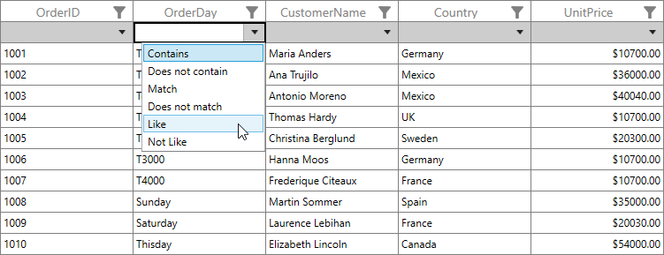
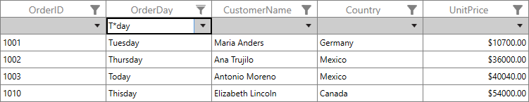

# How to implement the custom Like filter in WPF DataGrid (SfDataGrid) FilterRow? 

## About the sample

This sample illustrates how to implement the custom Like filter in [WPF DataGrid](https://www.syncfusion.com/wpf-ui-controls/datagrid) (SfDataGrid) FilterRow.

The textBox editor will display the string related conditions like Begins With, Does Not Begin With, Ends With, Does Not End With, Contains, Does Not Contain, Empty, Not Empty filter row conditions in drop down by default in [WPF DataGrid](https://www.syncfusion.com/wpf-ui-controls/datagrid) (SfDataGrid). You can display custom filter row conditions (Like and Not Like) in TextBox editor by overriding the [OpenFilterOptionPopup](http://help.syncfusion.com/cr/cref_files/wpf/Syncfusion.SfGrid.WPF~Syncfusion.UI.Xaml.Grid.RowFilter.GridFilterRowCell~OpenFilterOptionPopup.html) method in a [GridFilterRowCell](http://help.syncfusion.com/cr/cref_files/wpf/Syncfusion.SfGrid.WPF~Syncfusion.UI.Xaml.Grid.RowFilter.GridFilterRowCell.html) class.

```c#

public partial class MainWindow : Window
{
    public MainWindow()
    {
        InitializeComponent();

        this.sfDataGrid.FilterRowCellRenderers.Add("TextBoxExt", new GridFilterRowTextBoxRendererExt());
        this.sfDataGrid.RowGenerator = new CustomRowGenerator(this.sfDataGrid);
       
    }
}

public class GridFilterRowCellExt : GridFilterRowCell
{

    public GridFilterRowCellExt()
        : base()
    { }

    /// <summary>
    /// Opens the FilterOptionPopup with the FilterOptionList.
    /// </summary>

    public override void OpenFilterOptionPopup()
    {
        base.OpenFilterOptionPopup();

        if (this.DataColumn.GridColumn.MappingName != "OrderDay")
            return;
        var list = this.OptionsList();

        if (list.Count > 0)
            this.FilterOptionsList.ItemsSource = list;
    }

    /// <summary>
    /// Populates the FilterOption list which will loaded in FilterOptionPopup for ShipAddress.
    /// </summary>
    /// <returns></returns>

    private new ObservableCollection<string> OptionsList()
    {
        var list = new ObservableCollection<string>();
        list.Add("Contains");
        list.Add("Does not contain");
        list.Add("Match");
        list.Add("Does not match");
        list.Add("Like");
        list.Add("Not Like");
        return list;
    }
}

public class GridFilterRowTextBoxRendererExt : GridFilterRowTextBoxRenderer , INotifyPropertyChanged
{
    public FilterType customfilterType { get; set; }
    public GridFilterRowTextBoxRendererExt()
        : base()
    {
    }

    public override void OnFilterRowConditionChanged(string filterRowCondition)
    {
        
        switch (filterRowCondition)
        {
            case "Contains":
                customfilterType = FilterType.Contains;
                break;
            case "DoesNotContains":
                customfilterType = FilterType.NotContains;
                break;
            case "Match":
                customfilterType = FilterType.Equals;
                break;
            case "Does not match":
                customfilterType = FilterType.NotEquals;
                break;
            case "Like":
                customfilterType = FilterType.StartsWith;
                break;
            case "Not Like":
                customfilterType = FilterType.NotStartsWith;
                break;
            default:
                customfilterType = FilterType.Equals;
                break;

        }
    }

    public override void ProcessSingleFilter(object filterValue)
    {
        if (this.FilterRowCell.DataColumn.GridColumn == null)
            return;

        var filterPredicates = this.GetFilterPredicates(filterValue);
        var _filterText = this.GetFilterText(filterPredicates);
        this.ApplyFilters(filterPredicates, _filterText);
        this.IsValueChanged = false;
    }

    protected new List<FilterPredicate> GetFilterPredicates(object filterValue)
    {
        var column = this.FilterRowCell.DataColumn.GridColumn;
        if (column == null)
            return null;

       var filterPredicates = new List<FilterPredicate>();
       if(customfilterType == FilterType.StartsWith)
        {
            if (filterValue.ToString().Contains('*') || filterValue.ToString().Contains('?'))
            {
                object value1 = filterValue.ToString().Substring(0, 1);
                object value2 = filterValue.ToString().Substring(2, 3);
                filterPredicates.Add(new FilterPredicate()
                {
                    FilterBehavior = FilterBehavior.StringTyped,
                    FilterMode = ColumnFilter.Value,
                    FilterType = FilterType.StartsWith,
                    FilterValue = value1,
                    IsCaseSensitive = false,
                    PredicateType = PredicateType.And
                });
                filterPredicates.Add(new FilterPredicate()
                {
                    FilterBehavior = FilterBehavior.StringTyped,
                    FilterMode = ColumnFilter.Value,
                    FilterType = FilterType.EndsWith,
                    FilterValue = value2,
                    IsCaseSensitive = false,
                    PredicateType = PredicateType.And
                });
            }
        }           
        else
        {
            filterPredicates.Add(new FilterPredicate()
            {
                FilterBehavior = FilterBehavior.StringTyped,
                FilterMode = ColumnFilter.Value,
                FilterType = customfilterType,
                FilterValue = filterValue,
                IsCaseSensitive = false,
                PredicateType = PredicateType.OrElse
            });
        }
        return filterPredicates;
    }
   

    public event PropertyChangedEventHandler PropertyChanged;

    private void OnPropertyChanged(String prop)
    {

        if (PropertyChanged != null)
        {
            PropertyChanged(this, new PropertyChangedEventArgs(prop));
        }
    }
}
public class CustomRowGenerator : RowGenerator
{
    public CustomRowGenerator(SfDataGrid dataGrid)
        : base(dataGrid)
    {
    }

    /// <summary>
    /// Return the Custom FilterRowCell
    /// </summary>
    /// <typeparam name="T"></typeparam>
    /// <returns>GridCell</returns>

    protected override GridCell GetGridCell<T>()
    {

        //If the Cell is FilterRowCell return custom FilterRowCell

        if (typeof(T) == typeof(GridFilterRowCell))
            return new GridFilterRowCellExt();
        return base.GetGridCell<GridCell>();
    }
}


```





KB article - [How to implement the custom Like filter in WPF DataGrid (SfDataGrid) FilterRow?](https://www.syncfusion.com/kb/11880/how-to-implement-the-custom-like-filter-in-wpf-datagrid-sfdatagrid-filterrow)

## Requirements to run the demo
Visual Studio 2015 and above versions
